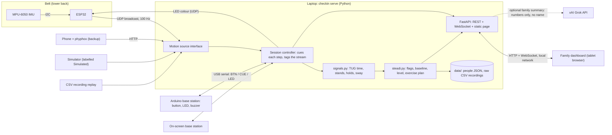

# Steady

**Steady: a belt, one button, and a family dashboard that bring the CDC's STEADI fall-risk screening into the home, then coach the exercises and count every rep.**

This is fall-risk screening: it flags increased fall risk and tracks change from baseline. It does not diagnose anything, predict when someone will fall, or guarantee prevention. We have not run a trial.

> **For judges, start here.** Run it with no hardware in two commands ([Quick start](#quick-start-no-hardware)); a full simulated check-in takes about a minute and a half. The hardware is an ESP32 + MPU-6050 belt and an Arduino base station ([How it works](#how-it-works)). The Grok features are described in [Grok / xAI](#grok--xai).

## The problem

- **About 1 in 4 U.S. adults aged 65+ report a fall each year** (14 million+), and falls are the leading cause of injury death in that age group ([CDC](https://www.cdc.gov/falls/)).
- **Alert pendants and watch fall detection only act after the fall, and often go unused.** In a UK cohort of people over 90, the person had a call alarm in 99% of falls where they were alone and couldn't get up, but didn't use it in 80% of those falls ([Fleming & Brayne, BMJ 2008](https://doi.org/10.1136/bmj.a2227)).
- **The CDC already has a prevention playbook, [STEADI](https://www.cdc.gov/steadi/)**: *screen* with three key questions, *assess* gait, strength, and balance with the Timed Up and Go, the 30-second chair stand, and the 4-stage balance test, then *intervene*, including exercise. It is built for a clinic visit, so at home it rarely happens and nobody tracks it between visits.
- **Exercise works:** a Cochrane review of 108 trials (23,407 people, average age 76) found exercise reduces the rate of falls by about 23%, with high-certainty evidence ([Sherrington et al. 2019](https://doi.org/10.1002/14651858.CD012424.pub2)). A pamphlet doesn't tell the family whether the exercises happened.

Our angle: run the **whole** STEADI loop at home (not just walking or just balance), keep it **screen-free for the older adult** (one button; the base station beeps every cue), and make exercise **sensor-verified**, so the family sees whether it was done. Full background, competitor table, and evidence: [`docs/COMPETITION.md`](docs/COMPETITION.md).

## What it does

| STEADI stage | In the product | How it's measured |
|---|---|---|
| **Screen** | The three key questions (fallen in the past year? unsteady? worried about falling?) in the profile | "Yes" to any is a flag |
| **Assess** | A guided check-in of about 3 minutes, with a family member standing by as STEADI requires: Timed Up and Go, the same walk while naming animals (dual-task), 30-second chair stand, balance stances (feet together, then semi-tandem, then tandem, 10 s each) | Lower-back sensor: TUG time to sit-down, stands counted, hold time and sway per stance. Flags: TUG ≥ 12 s, chair stands below the STEADI average for age and sex, tandem < 10 s. Dual-task cost is tracked against the person's baseline |
| **Intervene** | Exercise mode: sit-to-stand sets (a beep per rep) and counter-supported balance holds. The plan leans on the weakest area and steps up after enough exercise days | The same sensor counts reps and times holds |
| **Track** | Family dashboard: fall-risk level (green / amber / red, our own summary of the STEADI flags), trends, change from baseline, exercise adherence, and when to mention it to a doctor | Rolling baseline of recent check-ins; a sustained decline is flagged even without a STEADI flag |

The dashboard has three views: **Home** (plain words for the family), **Check-in** (full-screen step prompts with instruction pictures), and **For the doctor** (every number, the flags, trends, and a printable plain-text summary).

Safety by design: balance is done beside a counter, with no single-leg or eyes-closed stances; the chair stand stops and records 0 if arms are needed (the STEADI rule); the base-station button is a stopwatch fallback if sit-down detection misses; solo exercise is limited to supported moves.

## How it works

**Hardware**

| Part | What it is | Role |
|---|---|---|
| Belt | ESP32 + MPU-6050 (6-axis IMU) on an elastic belt at the lower back, USB power bank | Streams accelerometer + gyroscope at 100 Hz over Wi-Fi as UDP broadcast; has its own RGB status LED |
| Base station | Arduino (Uno R4 or Nano) with a push button, RGB LED, and passive buzzer | The only thing the older adult touches: button to start each step, beeps for "Go" / stop / each rep, LED for the result |
| Laptop | Runs `checkin serve` | Session controller, scoring, storage, web server |
| Tablet | Any browser on the same network | Family dashboard |
| Backup sensor | A phone in a belt pouch running phyphox | Drop-in replacement for the belt |

Every device sits behind an interface, so the simulator and an on-screen base station stand in for anything not plugged in. Parts, pins, and power: [`docs/PARTS_LIST.md`](docs/PARTS_LIST.md). Wire protocols: [`firmware/PROTOCOL.md`](firmware/PROTOCOL.md).



- **The laptop is the session controller.** For each step it sends the "Go" cue to the base station, tags the incoming motion stream with the step, scores the step when it ends, and pushes live state to the dashboard over a WebSocket.
- **Timing starts on the "Go" cue**, as in the clinical protocol, so the sensor only has to detect the end: the final sit-down (trunk pitch settles and motion stops) for the TUG, rise cycles for chair stands and sit-to-stands, and a departure from the stance posture for balance. Scoring thresholds are named constants at the top of [`src/checkin/signals.py`](src/checkin/signals.py).
- **Scores are whole-step totals**, so the belt, the phone, and the button don't need sub-second clock alignment.
- **Local first.** No CDN or web fonts from the network (Chart.js and the font are vendored), JSON files instead of a database, and the dashboard works on an offline access point. The only optional network call is the Grok family summary.
- **Every session's raw stream is saved** to `data/recordings/`, so any real session can be re-scored after tuning (`checkin replay`) or played back through the live dashboard.

## Quick start (no hardware)

Needs [uv](https://docs.astral.sh/uv/) (it fetches Python 3.11 if needed).

```bash
uv sync
uv run checkin serve --source sim --base virtual
```

Open http://localhost:8000. Everything the simulated sensor produces is labelled "Simulated" on screen, in charts, and in summaries.

1. **See a flag and the recovery:** pick the simulated example person (marked Simulated) in the person menu. Eight weeks of simulated check-ins show chair stands slipping from 13 to 10, two amber check-ins, an exercise plan, adherence going up to 5 days a week, and scores recovering. The history is generated on first run so it ends today (`uv run checkin seed` regenerates it).
2. **Run a check-in:** pick **Guest**, set age and sex in **Edit profile**, press **Start check-in**, then **We're ready: start**. Press **I'm ready** (the on-screen base-station button) at each step; the simulator acts out the step and the page plays the buzzer tones. Results, flags, and change from baseline appear when it finishes.
3. **Exercise mode:** **Start quick exercise** runs 5 sit-to-stands, with a beep and a count per rep.
4. **Summaries:** **Make a summary** writes one for the family and one for the doctor. Without an xAI key it uses fixed wording and nothing leaves the laptop.

On a tablet on the same network, open http://LAPTOP-IP:8000.

## Hardware setup

Wiring, firmware upload with `arduino-cli`, every sensor and base-station combination, the phone backup, replaying recordings, and the public demo deploy are in [`docs/HARDWARE.md`](docs/HARDWARE.md). The full build runs with:

```bash
uv run checkin serve --source udp --base serial --serial-port /dev/cu.usbmodem1101
```

Serial port, UDP port (default 4210), and Wi-Fi credentials are settings (flags, environment variables, or `firmware/esp32_imu/secrets.h`), never hard-coded.

## Grok / xAI

What is built today:

- **Plain-language family summary.** **Make a summary** sends the doctor summary (numbers only, never the person's name) to a Grok model (`grok-4.3` by default) and asks for 3 to 5 plain sentences for the family. The reply is shown only if it passes guardrails in [`src/checkin/summary.py`](src/checkin/summary.py): no diagnosis, prediction, or guarantee wording, no medical or medication advice, no clinical jargon, and **no number that isn't in the recorded data**. Otherwise, or with no key or no internet, the family gets a fixed-template summary. Set `XAI_API_KEY` to turn it on (`CHECKIN_GROK_MODEL` to change the model).
- **Ask Steady.** With a key, Home has a question box ("Is he doing his exercises?"). Grok answers in 1 to 3 sentences from the same doctor summary text, and the reply passes the same guardrails before it's shown, labelled AI-written. Questions that need a prediction, diagnosis or medical advice ("Will Dad fall this year?") are never sent; they, and any reply that fails a check, get "I can only answer from the check-in results" plus the fixed-wording summary.
- **Grok on/off.** The footer on every view reads "Grok: on" or "Grok: off (works offline)", with **Turn Grok off** / **Turn Grok on**. `CHECKIN_AI=off` turns every Grok call off for good. With Grok off, nothing leaves the laptop and everything else works the same.
- **Instruction pictures.** The pictures on the check-in screen (TUG, chair stand, the three foot positions, sit-to-stand, supported hold) were generated with Grok Imagine by [`scripts/make_images.py`](scripts/make_images.py) and are committed to [`src/checkin/static/img/`](src/checkin/static/img/), so the dashboard needs no network at run time.

<!-- GROK PLACEHOLDER: another effort may add Grok/SpaceXAI features. Replace this block with what was built, how to turn it on, and what data leaves the laptop. -->
> **Placeholder: more Grok / SpaceXAI track features.** Reserved for features being added in a separate effort. Not implemented in this revision.

## Tech stack

| Layer | Choice |
|---|---|
| Server | Python 3.11, FastAPI + Uvicorn, WebSocket for live state, NumPy for signal processing, pyserial for the base station |
| Frontend | One static page: vanilla HTML/JS, vendored Chart.js 4.5.1 and Archivo font (OFL), no build step |
| Storage | JSON files per person and CSV recordings in `data/` (git-ignored) |
| Firmware | Arduino sketches built with `arduino-cli`: ESP32 belt (UDP), Arduino base station (serial) |
| AI (optional) | xAI Grok chat completions for the family summary; Grok Imagine for the committed instruction pictures |
| Tooling | uv, pytest (175 tests, including a full simulated check-in scored against the simulator's true values), ruff |

## Repo layout

```
src/checkin/
  cli.py          checkin serve | replay | seed
  server.py       FastAPI app: REST API, WebSocket, static page
  controller.py   session controller: steps, cues, button, live state
  signals.py      step scoring from the IMU stream (thresholds at the top)
  steadi.py       STEADI flags, cutoffs, baseline, level, exercise plan, adherence
  sources.py      motion sources: sim, csv replay, udp (ESP32), phyphox
  base.py         base stations: virtual (on-screen) and serial (Arduino)
  sim.py          simulated lower-back IMU with known true scores
  seed.py         the simulated eight-week example history
  store.py        people JSON and CSV recordings
  summary.py      doctor summary, family summary (Grok with guardrails, or template)
  static/         index.html, app.js, instruction pictures, vendored Chart.js and font
firmware/
  esp32_imu/      belt: MPU-6050 over I2C, UDP broadcast, status LED
  base_station/   Arduino: button, RGB LED, buzzer over USB serial
  imu_test/       bare MPU-6050 wiring check
  phyphox/        phone backup experiment (accelerometer + gyroscope at 100 Hz)
  PROTOCOL.md     serial and UDP line formats
docs/
  COMPETITION.md  spec: problem, evidence, check-in design, claims, demo script
  HARDWARE.md     running on real devices
  PARTS_LIST.md   parts, wiring, power
  API.md          REST and WebSocket API used by the page
scripts/
  make_images.py  regenerate the instruction pictures with Grok Imagine
tests/            pytest suite
```

## Development

```bash
uv run pytest
uv run ruff check .
uv run checkin replay data/recordings/FILE.csv --age 72 --sex female   # re-score a saved session
```

## Limitations

- No trial of this device exists. The exercise evidence comes from structured programs; our coached subset (sit-to-stands, supported balance holds) is the same type of exercise but untested as a program.
- The scoring approach follows a 2024 lower-back IMU study that matched human raters within about 4% (TUG) and 8% (chair stands). Balance timing agreed least well in that study, so balance is our least certain score.
- The dual-task step doesn't listen for speech yet; the helper confirms the person kept naming animals.
- Chair-stand norms start at age 60, so younger people (including judges) are compared with the 60–64 line, labelled "the youngest STEADI group" on the dashboard.

## Team and credits

<!-- TEAM PLACEHOLDER: fill in the three member names, roles, and links. -->
- **Team:** dh squad (3 members): _names to be added_
- **Repository:** [github.com/kevinyyin/dhsquad](https://github.com/kevinyyin/dhsquad)
- Built at HackGT for the Hardware track, the Aramco social good track, and the SpaceXAI / Grok track.
- Clinical tests and cutoffs: CDC [STEADI](https://www.cdc.gov/steadi/). Charts: [Chart.js](https://www.chartjs.org/) (MIT). Font: Archivo (SIL Open Font License, `src/checkin/static/vendor/archivo-OFL.txt`).
