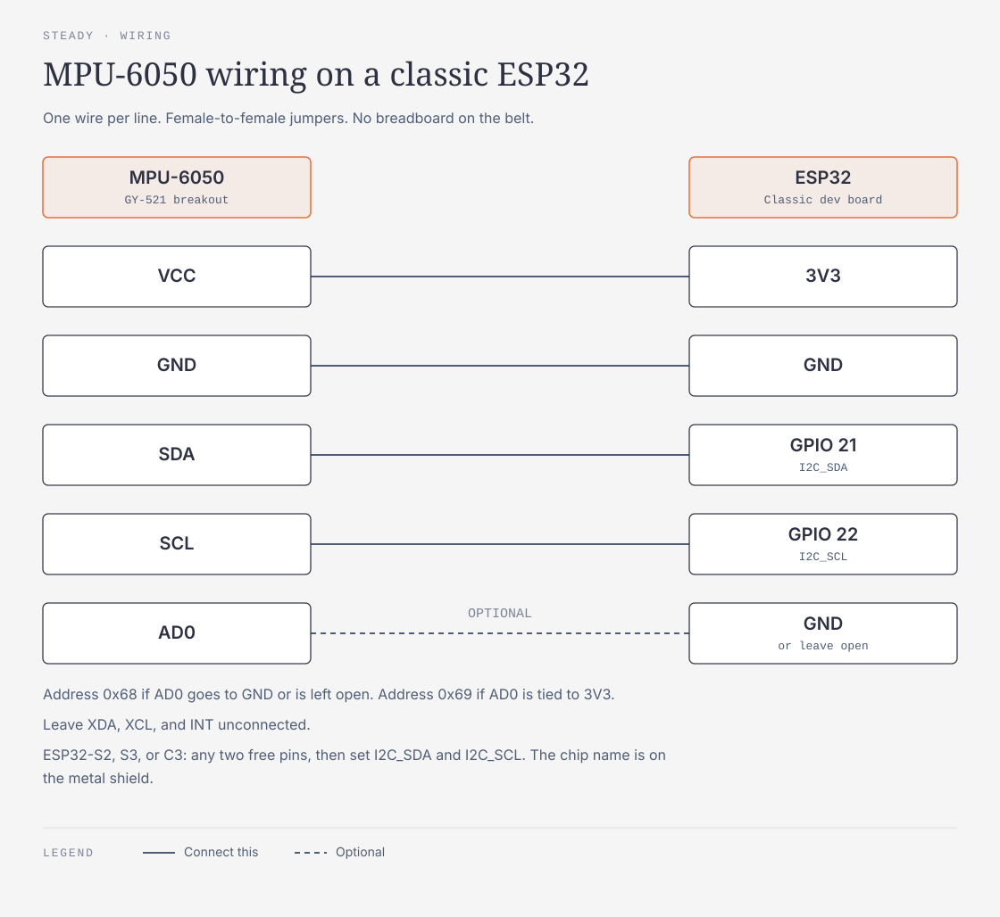
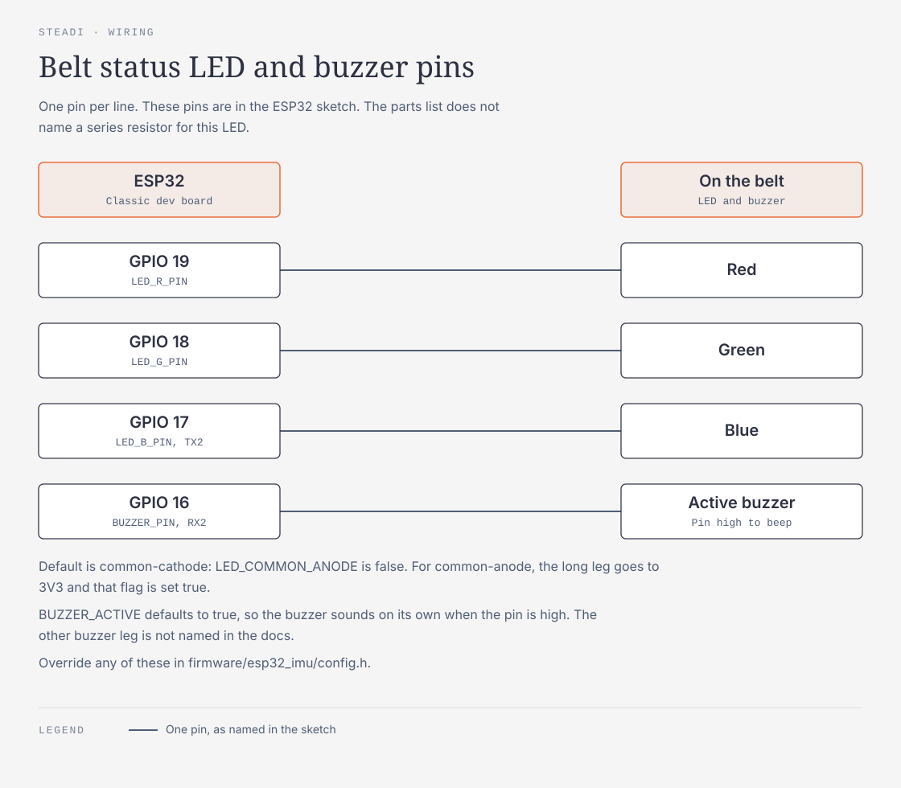
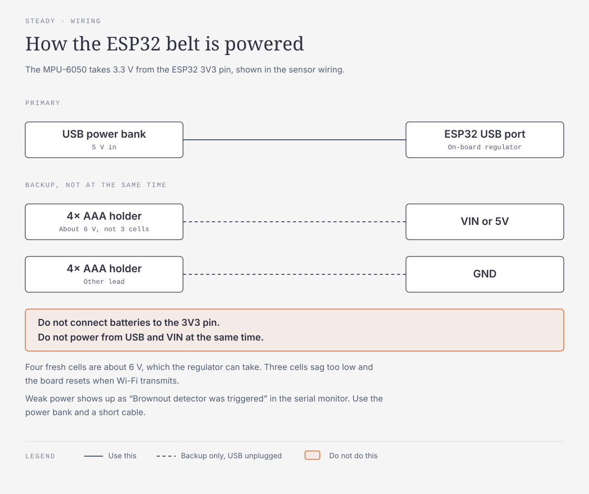
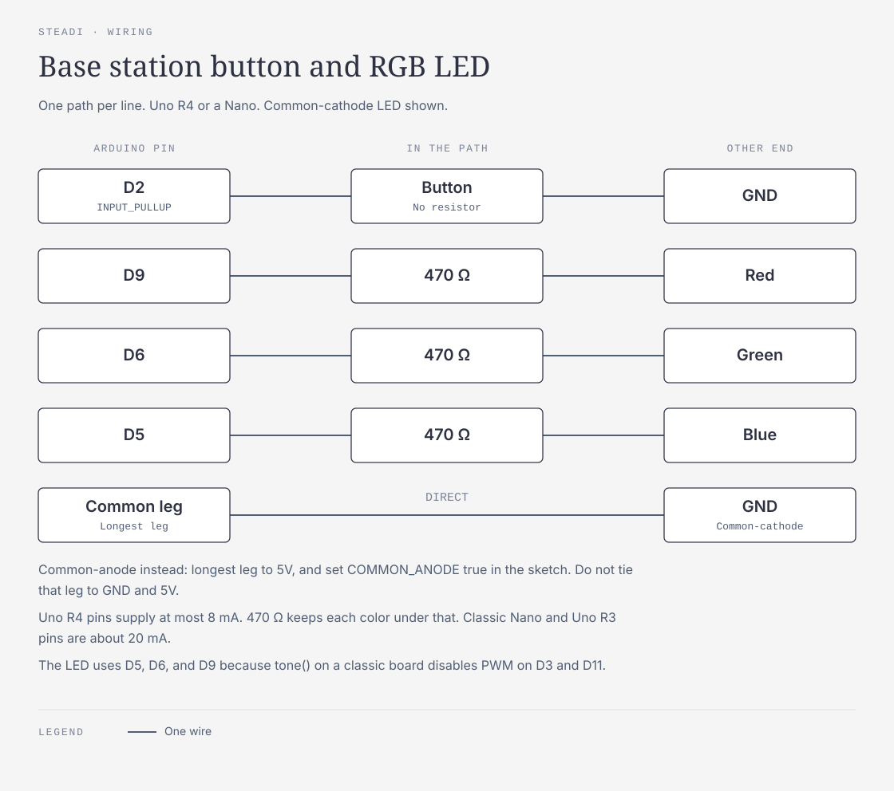
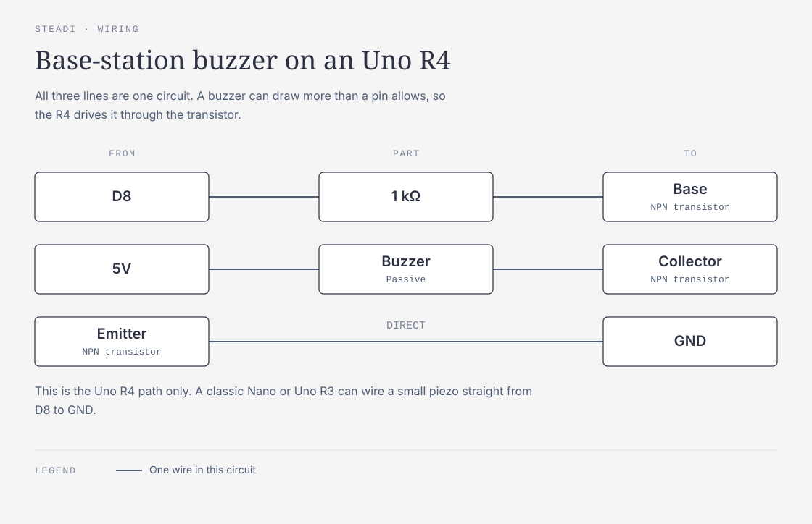
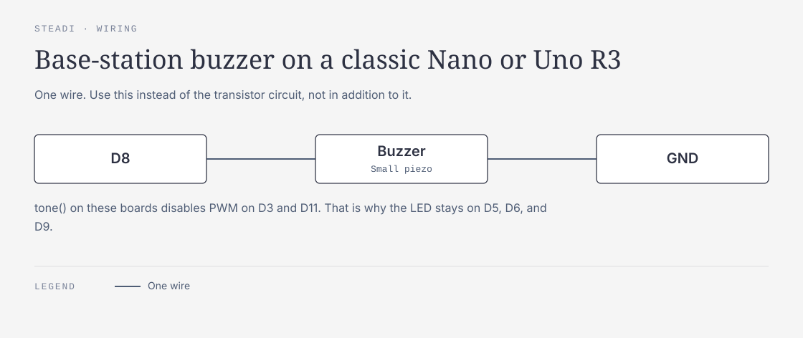

# Hardware setup

How to run the check-in on real devices. Parts, pins, and power: `PARTS_LIST.md`. Wire formats: `../firmware/PROTOCOL.md`. Everything also runs with no hardware (`uv run checkin serve --source sim --base virtual`).

## Combinations

Every device sits behind the same interface, so mix and match:

| Sensor (`--source`) | Base station (`--base`) | Use it for |
|---|---|---|
| `sim` | `virtual` | Development and a demo with no hardware |
| `udp` (ESP32 belt) | `virtual` | Belt works, Arduino not wired yet |
| `udp` (ESP32 belt) | `serial` | The full build |
| `phyphox:http://PHONE-IP:8080` | `serial` or `virtual` | Backup if the belt fails |
| `csv:data/recordings/FILE.csv` | either | Replay a real recorded session through the live dashboard |
| `sim` | `serial` | Test the Arduino on its own |

Settings are flags or environment variables, never code: `--udp-port` / `CHECKIN_UDP_PORT` (default 4210), `--serial-port` / `CHECKIN_SERIAL_PORT`, `--port` (default 8000), `--data` (default `data/`). Optional AI family summary: `XAI_API_KEY` (and `CHECKIN_GROK_MODEL`, default `grok-4.3`); without it the summary uses fixed wording and nothing leaves the laptop. `CHECKIN_AI=off` turns every Grok call off even with a key.

Tablet on the same network: http://LAPTOP-IP:8000 (the server listens on all interfaces; macOS asks once to allow incoming connections).

## 1. Simulator + on-screen base station

```bash
uv run checkin serve --source sim --base virtual
```

The page plays the buzzer tones (click the Button once so the browser allows sound) and shows the LED.

## 2. ESP32 belt (UDP)

Wiring: `PARTS_LIST.md` Section 1 (MPU-6050 VCC→3V3, GND→GND, SDA→GPIO 21, SCL→GPIO 22).







```bash
cp firmware/esp32_imu/secrets.example.h firmware/esp32_imu/secrets.h   # then put in the hotspot name and password
arduino-cli compile --fqbn esp32:esp32:esp32 firmware/esp32_imu
arduino-cli board list                                                  # find the port, e.g. /dev/cu.usbserial-0001
arduino-cli upload --fqbn esp32:esp32:esp32 -p /dev/cu.usbserial-0001 firmware/esp32_imu
arduino-cli monitor -p /dev/cu.usbserial-0001 -c baudrate=115200        # expect "MPU-6050 streaming at 100 Hz"
uv run checkin serve --source udp --base virtual
```

The dashboard's sensor line should read about 100 Hz. With `--source udp` the laptop also lights the belt's own RGB LED (pins in `firmware/PROTOCOL.md`). Settings live in `firmware/esp32_imu/config.h`:

- **ESP32-S2/S3/C3 boards:** wire SDA/SCL to any two free pins and set `I2C_SDA`/`I2C_SCL`. Compile with that board's FQBN, e.g. `esp32:esp32:esp32s3`.
- **Hotspot drops broadcast packets** (sensor stuck at 0 Hz while the serial monitor says it's streaming): set `UDP_TARGET_IP` to the laptop's IP.
- **Clone chip:** a WHO_AM_I other than 0x68 is reported and ignored.
- **Other UDP port:** change `UDP_PORT` and pass the same `--udp-port`.
- **Watch raw packets:** `nc -ul 4210`.
- **"Brownout detector was triggered":** weak power; use the power bank and a short cable (`PARTS_LIST.md` Section 6).

`firmware/imu_test` is a bare MPU-6050 reader for checking the wiring over USB serial before the Wi-Fi sketch.

## 3. Arduino base station (USB serial)

Wiring: `PARTS_LIST.md` Section 2 (button D2→GND, LED R/G/B on D9/D6/D5 via 470 Ω, buzzer on D8 via the transistor on an Uno R4). For a common-anode LED set `COMMON_ANODE = true` in the sketch.







```bash
arduino-cli compile --fqbn arduino:renesas_uno:minima firmware/base_station   # Uno R4 Minima; arduino:avr:uno or arduino:avr:nano for classic boards
arduino-cli upload --fqbn arduino:renesas_uno:minima -p /dev/cu.usbmodem1101 firmware/base_station
uv run checkin serve --source udp --base serial --serial-port /dev/cu.usbmodem1101
```

Check it by hand first: `arduino-cli monitor -p /dev/cu.usbmodem1101 -c baudrate=115200`, type `CUE start` (two beeps) and `LED amber`, and press the button (prints `BTN`). On Windows the port is `COM3` or similar.

## 4. Phone backup (phyphox)

1. Install phyphox and load `firmware/phyphox/belt-imu.phyphox` (accelerometer + gyroscope at 100 Hz). The built-in "Acceleration with g" experiment also works but has no gyroscope.
2. Menu → **Allow remote access**. phyphox shows an address like `http://192.168.1.23:8080` (port 80 on iPhones).
3. Put the phone in a belt pouch at the lower back, any orientation.

```bash
uv run checkin serve --source phyphox:http://192.168.1.23:8080 --base serial --serial-port /dev/cu.usbmodem1101
```

## 5. Replay a recording

Every session saves its raw stream to `data/recordings/`. To re-score one (for example after tuning thresholds in `src/checkin/signals.py`):

```bash
uv run checkin replay data/recordings/20260926-100516-checkin.csv --age 72 --sex female
```

Or play it back through the live dashboard, one step per button press:

```bash
uv run checkin serve --source csv:data/recordings/20260926-100516-checkin.csv --base virtual
```

## 6. Public demo (Render)

A web service on render.com (not Vercel: the app needs a long-running process and a WebSocket). Build command `uv sync --frozen`; start command `uv run checkin serve --source sim --base virtual --demo --port $PORT`. `--demo` makes Guest ready to start (age 72, female) and turns off adding or editing people. Set no environment variables: without `XAI_API_KEY` the summary uses fixed wording and the site makes no paid calls. Data resets whenever the service restarts.

## Running a real check-in

1. Profile (**Edit profile**, step 0): age, sex, and the three STEADI key questions.
2. Setup per STEADI: an arm chair for the TUG, an armless ~17-inch chair for the chair stand, a 3 m taped line, a counter for balance. A family member stands by for the whole check-in.
3. **Start check-in** shows the setup checklist; **We're ready: start** begins. At each step the helper presses the base-station button (or **I'm ready** on screen) when the person is ready. The "Go" beeps start the timing.
   - During a TUG, a press stops the clock (the stopwatch fallback if sit-down detection misses).
   - During a balance stance, a press marks the stance as broken.
   - During the chair stand, **Stop: they needed their arms** stops it and records 0 (STEADI).
4. Results, flags, and change from baseline appear on the dashboard. The LED shows green/amber/red.

Exercise mode (**Start today's exercises**) runs the person's plan: sit-to-stand sets (a beep per rep) and counter-supported balance holds. **Start quick exercise** runs one set of 5 for demos.
